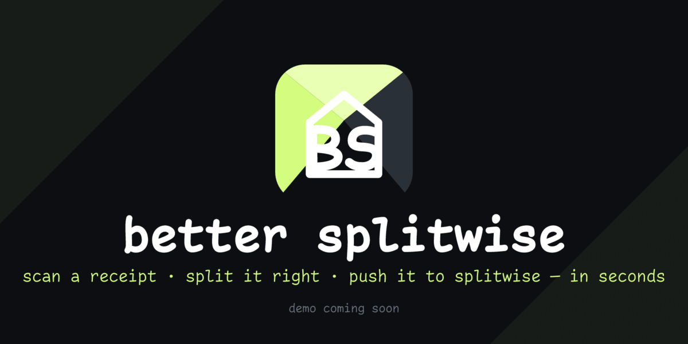

<h1 align="center">better splitwise</h1>

<p align="center">
  <strong>a small splitwise client i made for myself.</strong>
</p>

<p align="center">
  <a href="LICENSE"></a>
  
  
  
</p>

<p align="center">
  <picture>
    <source media="(prefers-reduced-motion: reduce)" srcset="docs/assets/readme/better-splitwise-header-poster.png">
    
  </picture>
</p>

<p align="center"><em>snap the bill, tap who had each item, one fair expense in your splitwise.</em></p>

## the idea

splitwise is good at tracking who owes whom. it's bad at entering a messy group dinner.
itemizing by hand is slow, and "split equally" goes wrong the moment someone skips something.

so this is just the front end i wanted for it. it talks to splitwise, so every
expense it creates is a real splitwise expense your friends already see. there's no second
ledger and nothing for anyone else to install. it does the few things i do constantly, in
as few taps as i could manage. "better" means better for how i split bills, not
objectively. (and yes, the icon says BS. both readings intended.)

## how a split works

scan, review, assign, push:

1. **scan** - snap or pick a receipt; your own Gemini key reads it back (on-device) as items, tax, tip and fees.
2. **review** - fix anything the scan got wrong.
3. **who's in** - pick a group or friend; attendees pre-fill.
4. **assign** - tap an item, tap who shared it; **everyone** / **just me** for speed.
5. **confirm** - see each person's breakdown, then push: one real splitwise expense with correct paid/owed shares and an itemized comment.

## why it's better (for me)

- it's a handful of screens that do what i want and nothing i don't.
- the slow part, typing the receipt out, becomes a photo.
- you assign each line to the people who actually shared it, instead of a fake equal split.
- your splitwise and Gemini keys stay on-device, and the app keeps no backend of its own.
  each split's line items live in the splitwise comment, so they travel with the expense,
  reopen as a full breakdown, and survive a reinstall.

## the monorepo

a turborepo: the Expo app where scanning happens, the marketing site, and a few small
framework-free packages they share.

| package | what it does |
| --- | --- |
| [`apps/mobile`](apps/mobile) | the Expo app — expo router, nativewind, react query |
| [`apps/web`](apps/web) | the marketing site — astro + tailwind |
| [`@repo/split-core`](packages/split-core) | the split engine: per-item, weighted, exact fee allocation |
| [`@repo/splitwise`](packages/splitwise) | a thin splitwise api client + adapters |
| [`@repo/ocr`](packages/ocr) | provider-agnostic receipt extraction (Gemini adapter) |

## run it yourself

not on the stores yet, so build from source. needs [Bun](https://bun.sh) `1.3+` (plus the
[Expo](https://docs.expo.dev) toolchain + a simulator/emulator for mobile).

```bash
git clone https://github.com/jassuwu/better-splitwise.git
cd better-splitwise && bun install
bun run dev:mobile   # or: bun run dev:web
```

then add your keys once, in-app. they're stored in the device keychain, never a file. you
need a **splitwise api key** ([your apps](https://secure.splitwise.com/apps)) to read and
write your data, and optionally a **Gemini key** ([AI Studio](https://aistudio.google.com/app/apikey))
for scanning. other scripts: `bun run test · tc · lint · format`, and `cd apps/mobile && bun run icons`.

## brand

a faithful parody of the splitwise icon: the same faceted "gem" house, but lime, and the
lone _S_ becomes _BS_, recreated in **Montserrat**, splitwise's own typeface. one source
svg in [`build-icons.ts`](apps/mobile/scripts/build-icons.ts) builds the whole icon set.

---

<div align="center">

an unofficial client · not affiliated with, or endorsed by, Splitwise, Inc. · [MIT](LICENSE)

</div>
